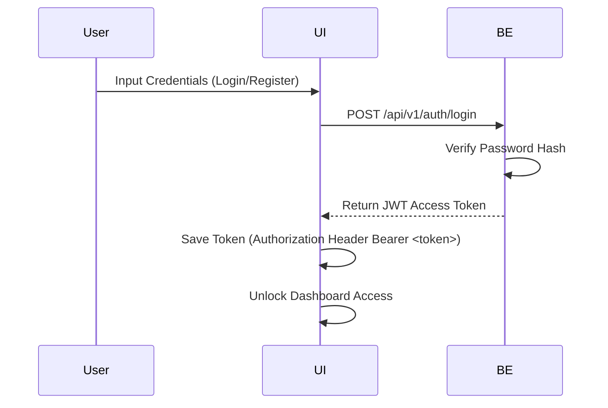

# NeuroScan — User Manual

**Version:** 1.0.0  
**Project Round:** JTP 2026  
**Platform:** Web Browser (Desktop and tablet viewports recommended)  
**Deployment Base URL:** http://localhost *(Local Docker)*

---

## Table of Contents

1. [Introduction](#1-introduction)
   - [Core Architecture Highlights](#core-architecture-highlights)
2. [Getting Started](#2-getting-started)
   - [Accessing the Portal](#accessing-the-portal)
   - [User Authentication](#user-authentication)
3. [Running a Diagnosis — Step by Step](#3-running-a-diagnosis--step-by-step)
   - [Step 1: Uploading the MRI Scan](#step-1-uploading-the-mri-scan)
   - [Step 2: Running the Prediction](#step-2-running-the-prediction)
   - [Step 3: Viewing the Result](#step-3-viewing-the-result)
   - [Step 4: Downloading the Report](#step-4-downloading-the-report)
4. [Understanding Diagnostic Results](#4-understanding-diagnostic-results)
   - [Classification Classes](#classification-classes)
5. [Viewing Prediction History](#5-viewing-prediction-history)
6. [API & Interactive Swagger Verification](#6-api--interactive-swagger-verification)
   - [Direct API Curl Calls](#direct-api-curl-calls)
7. [Frequently Asked Questions](#7-frequently-asked-questions)
8. [Troubleshooting & Terminal Commands](#8-troubleshooting--terminal-commands)

---

## 1. Introduction

NeuroScan is a research and educational platform that implements a deep learning pipeline to classify brain MRI scans. Using a Convolutional Neural Network (CNN) built in PyTorch, the system classifies an uploaded brain MRI slice into one of four categories: Glioma, Meningioma, Pituitary, or No Tumor. It streamlines the workflow of uploading a scan, running inference, viewing the prediction, and generating a downloadable report.

### Core Architecture Highlights
- PyTorch CNN-based Brain Tumor Classification
- Secure JWT Authentication
- Prediction History
- PDF Report Generation
- PostgreSQL Database
- MongoDB Integration (application metadata)
- Swagger API Documentation
- Dockerized Deployment

---

## 2. Getting Started

### Accessing the Portal

1. Launch a modern web browser (Google Chrome, Mozilla Firefox, Microsoft Edge, or Apple Safari recommended).
2. Enter the deployment URL in the browser's address bar:
   * **Local Environment:** [http://localhost](http://localhost) (served through the Nginx frontend reverse proxy).
3. The browser will render the NeuroScan landing page, showing the online/offline status indicator in the top navigation bar.

### User Authentication

All diagnostic pages are protected by a JSON Web Token (JWT) gate.



1. Click **Login** or **Register** in the top navigation menu.
2. **If registering a new account:**
   * Click **Register**.
   * Enter your name, email address, and a secure password.
   * Optionally enter your organization.
   * Select a role from the dropdown (e.g., Researcher).
   * Click **Register**.
3. **If logging in:**
   * Enter your email, password, and select **Login As** role.
   * Click **Login**.
   * The frontend stores the returned JWT and attaches it to all subsequent API requests inside the `Authorization: Bearer <token>` header.

---

## 3. Running a Diagnosis — Step by Step

---

### Step 1: Uploading the MRI Scan

**Purpose:** Select and validate the target MRI slice image.

```
+-------------------------------------------------------------+
|                                                             |
|                    Drop an MRI scan here                    |
|              OR CLICK TO BROWSE · JPG, JPEG, PNG             |
|                       Max 10MB                               |
|                                                             |
+-------------------------------------------------------------+
```

1. Navigate to the **Diagnose** page.
2. Click the upload box to open the native system file explorer, or drag a JPG/PNG axial brain MRI slice directly into the drop zone.
3. The browser validates the file:
   * **Format Check:** Rejects non-image extensions.
   * **Size Check:** Enforces the maximum file size (10MB, matching the backend `MAX_UPLOAD_SIZE` variable).
4. Once validated, a preview of the uploaded MRI scan is displayed along with the filename and file size.

---

### Step 2: Running the Prediction

**Purpose:** Send the image to the backend CNN model for classification.

1. With an image uploaded, the frontend sends the file as a `multipart/form-data` request to:
   ```http
   POST /api/v1/predict/
   ```
2. The backend:
   * Saves the image to `backend/uploads/`.
   * Decodes and converts the image to RGB, then resizes it to 32×32 px and converts it to a tensor.
   * Runs a forward pass through the CNN to produce raw logits, then applies Softmax to obtain class probabilities.

---

### Step 3: Viewing the Result

**Purpose:** Review the prediction returned by the model.

```
Diagnosis: Pituitary
Confidence: 100.0%
```

1. **Diagnosis Readout:** Displays the predicted tumor class (Glioma, Meningioma, Pituitary, or No Tumor).
2. **Confidence:** Displays the model's confidence score for the predicted class.
3. **Class Probabilities:** Lists the probability the model assigned to each of the four classes.
4. Use **New Scan** to upload another image, **Copy** to copy the result, or **Download JSON** to save the raw prediction output.

---

### Step 4: Downloading the Report

**Purpose:** Generate and save a record of the prediction.

1. Each completed prediction is automatically saved to your account's history.
2. From the **History** page, locate the relevant entry and click **PDF Report** to download a report of that prediction.

---

## 4. Understanding Diagnostic Results

### Classification Classes

The CNN model predicts one of four tumor categories based on patterns learned during training:

| Tumor Class | Description |
| :--- | :--- |
| **Glioma** | A tumor arising from glial cells, often showing irregular margins in the surrounding brain tissue. |
| **Meningioma** | A typically well-circumscribed tumor arising from the meninges, the membranes surrounding the brain. |
| **Pituitary** | A mass localized within or extending out of the pituitary gland region (sella turcica). |
| **No Tumor** | No abnormal tissue mass detected in the scan. |

> This classification is generated by a research-purpose CNN model and is not a substitute for a diagnosis from a qualified radiologist.

---

## 5. Viewing Prediction History

The **History** page lists every prediction you have previously run.

1. Navigate to the **History** tab in the top navigation menu.
2. Each row displays the date and time of the prediction, the predicted class, and the confidence score.
3. Click **PDF Report** next to any entry to download that prediction's report.

---

## 6. API & Interactive Swagger Verification

Developers can interact with the backend directly using Swagger.

1. Go to: `http://localhost:5000/swagger/`
2. Locate the `/api/v1/auth/login` endpoint block. Click **Try it out** and enter credentials:
   ```json
   {
     "email": "user@example.com",
     "password": "your_password"
   }
   ```
3. Copy the returned `access_token` string from the JSON response.
4. Scroll to the top of the Swagger page, click **Authorize**, enter `Bearer <your_copied_token>` in the box, and click **Authorize**.
5. You can now execute protected endpoints such as `GET /api/v1/predict/history` directly from the browser interface.

### Available Endpoints

```
POST /api/v1/auth/register
POST /api/v1/auth/login
GET  /api/v1/auth/me

POST /api/v1/predict/
GET  /api/v1/predict/history

GET  /api/v1/report/download/{id}
```

### Direct API Curl Calls

#### 1. Retrieve System Health Status
```bash
curl -X GET http://localhost:5000/api/v1/health
```
**Expected JSON output:**
```json
{
  "status": "UP"
}
```

#### 2. Run Image Classification via Terminal
```bash
curl -X POST http://localhost:5000/api/v1/predict/ \
  -H "Authorization: Bearer <your_jwt_token>" \
  -F "image=@/path/to/brain_mri.png"
```

---

## 7. Frequently Asked Questions

**Q: Why does the model predict a tumor but show zero confidence in other classes?**  
A: The final layer of the classifier applies a Softmax function, which normalizes output values into a probability distribution summing to 1.0. A high-confidence prediction (e.g. 99% Pituitary) naturally pushes the remaining categories close to 0%.

**Q: Where are the uploaded MRI images saved?**  
A: Images are saved inside the `backend/uploads/` directory on the server disk. The database stores metadata related to each prediction.

**Q: What kind of images should I use for accurate predictions?**  
A: Use axial MRI slices similar to those in the [Kaggle Brain Tumour Classification dataset](https://www.kaggle.com/datasets/rishiksaisanthosh/brain-tumour-classification), which the model was trained on. Using scans with comparable resolution and orientation will give the most reliable results.

**Q: How do we update the model weights file (`cnn.pth`)?**  
A: Replace the existing file at `backend/weights/cnn.pth` with your updated model file and restart the backend container. The application will load the new weights on startup.

---

## 8. Troubleshooting & Terminal Commands

### 1. Flask Fails to Start: Port 5000 in Use
* **Problem:** Port 5000 is occupied by another local service.
* **Terminal Diagnostics & Fixes:**
  * **On Windows (PowerShell):**
    ```powershell
    # Find process ID running on port 5000
    netstat -ano | findstr :5000
    # Stop the process using the retrieved PID
    taskkill /PID <PID> /F
    ```
  * **On macOS/Linux:**
    ```bash
    # Find process ID running on port 5000
    lsof -i :5000
    # Stop the process
    kill -9 <PID>
    ```

### 2. "Error loading predictor: cnn.pth not found"
* **Problem:** The model weights file is missing or in the wrong directory.
* **Terminal Diagnostics:**
  * Verify the folder path structure:
    ```bash
    # List weights folder contents
    ls project/backend/weights/
    ```
  * **Fix:** Ensure `cnn.pth` is placed in `project/backend/weights/` and that the `MODEL_PATH` variable in your `.env` matches this path.

### 3. PostgreSQL Database Connection Refused
* **Problem:** Relational database service is down or connection string is misconfigured.
* **Terminal Diagnostics & Fixes:**
  * Check database logs:
    ```bash
    docker compose logs postgres
    ```
  * Restart the service:
    ```bash
    docker compose restart postgres
    ```

### 4. MongoDB Access Timeout
* **Problem:** The document store is down, causing queries to hang.
* **Terminal Diagnostics:**
  * Check running containers:
    ```bash
    docker ps -a --filter name=neuroscan-mongodb
    ```
  * **Fix:** Ensure your `.env` contains the correct host connection string (`mongodb://mongodb:27017` inside Docker, or `mongodb://localhost:27017` for manual local setups).
